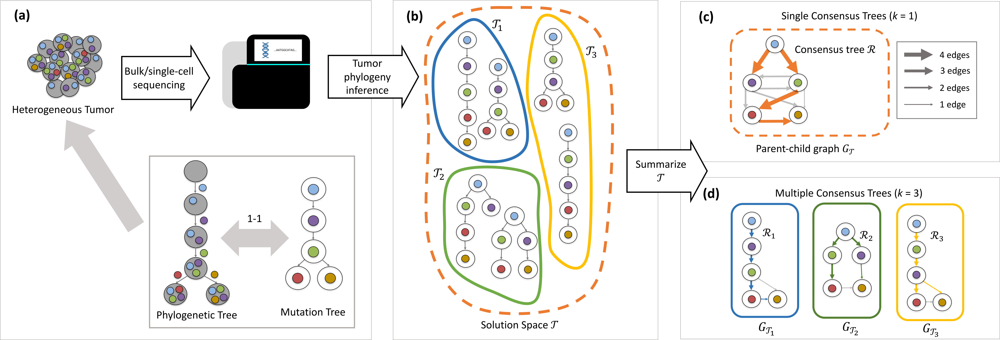

# MCT-Solver - Multiple Consensus Tree Solver

Multiple Consensus Tree (MCT) is a problem that takes a set of input trees on the same set of vertices and an integer k as input, find k consensus trees and a k-clustering of the input trees such that the sum of the distance of each input tree to its corresponding consensus tree is minimized.
MCT-Solver contains 3 approaches to this problem, Brute Force, MILP, and Coordinate Ascent.

## Contents

  1. [Compilation instructions](#compilation)
     * [Dependencies](#dep)
     * [Compilation](#comp)
  2. [Usage instructions](#usage)
     * [I/O formats](#io)
     * [Brute Force](#BF)
     * [MILP](#ILP)
     * [Coordinate Ascent](#CA)
     * [Solution visualization (`visualize`)](#viz)

## Compilation instructions

### Dependencies

MCT-Solver is written in C++11 and thus requires a modern C++ compiler (GCC >= 4.8.1, or Clang). In addition, SPhyR has the following dependencies.

* [CMake](http://www.cmake.org/) (>= 2.8)
* [Boost](http://www.boost.org) (>= 1.38)
* [LEMON](http://lemon.cs.elte.hu/trac/lemon) graph library (>= 1.3)
* [CPlex](https://www.ibm.com/analytics/data-science/prescriptive-analytics/cplex-optimizer) (>= 12.7)

[Graphviz](http://www.graphviz.org) is required to visualize the resulting DOT files, but is not required for compilation.

<!--In case [doxygen](http://www.stack.nl/~dimitri/doxygen/) is available, extended source code documentation will be generated.-->

### Compilation

To compile MCT-Solver, execute the following commands from the root of the repository:

    $ mkdir build
    $ cd build
    $ cmake .. -DCPLEX=1
    $ make 

In case CMake fails to detect LEMON, run the following command with adjusted paths:

    $ cmake -DLIBLEMON_ROOT=~/lemon 

The compilation results in the following files in the `build` directory:

EXECUTABLE | DESCRIPTION
-----------|-------------
`mCTPCA`   | The Coordinate Ascent approach to the MCT problem.
`mCTPILP`  | The MILP approach to the MCT problem.
`mCTPBF`   | The Brute Force approach to the MCT problem.
`visualize`| Visualizes a phylogenetic tree in Graphviz DOT format.

## Usage instructions

### I/O formats

MCT-Solver's input file is text based. The first line includes the the number of mutations (mutation clusters), in the format of "# m out of m mutations".
The second line includes the number of input trees, in the format of "n #trees" 
Then, each subsequent m line defines the an input tree. More specifically, the first line of the m lines includes the number of edges in the format of "m-1 #edges, tree i", and the following m-1 lines are descriptions of the edges of the tree in the format of "v1 v2" indicating that v1 is the unique parent of v2 in this tree.

### Brute Force (`mCTPBF`)

    Usage:
	  ./mCTPBF [--help|-h|-help] [-c str] -k int -p str [-t int] trees
	Where:
	  trees
		 Input trees
	  --help|-h|-help
		 Print a short help message
	  -c str
		 Clustering
	  -k int
		 Number of clusters
	  -p str
		 Path to results (make it unique)
	  -t int
		 Time limit in seconds (default: -1, no time limit)

An example execution:

    $ ./mCTPBF -k 2 -p output ../data/TracerX/T_CRUK0013.txt

The file `output_cluster0.dot`, `output_cluster1.dot` contains the Parent-Child graph and the optimal consensus tree of the 2 cluster.
The file `output_clustering.txt` contains the clustering of the input trees.
The file `output_summary.csv` contains the summary of result.

### MILP (`mCTPILP`)

	Usage:
	  ./mCTPILP [--help|-h|-help] [-T int] [-c str] -k int [-m int] -p str
		 [-t int] [-v] trees
	Where:
	  trees
		 Input trees
	  --help|-h|-help
		 Print a short help message
	  -T int
		 Number of threads (default: 1)
	  -c str
		 Clustering
	  -k int
		 Number of clusters
	  -m int
		 Memory limit in MB (default: -1, no memory limit)
	  -p str
		 Path to results (make it unique)
	  -t int
		 Time limit in seconds (default: -1, no time limit)
	  -v
		 Verbose output (default: False)

An example execution:

    $ ./mCTPILP -k 2 -p output ../data/TracerX/T_CRUK0013.txt

### MILP (`mCTPCA`)

	./mCTPCA -h
	Usage:
	  ./mCTPCA [--help|-h|-help] -k int -p str [-r int] [-s int] [-t int] trees
	Where:
	  trees
		 Input trees
	  --help|-h|-help
		 Print a short help message
	  -k int
		 Number of clusters
	  -p str
		 Path to results (make it unique)
	  -r int
		 Number of restarts (default: 50)
	  -s int
		 Seed for random number generator (default:0)
	  -t int
		 Time limit in seconds (default: -1, no time limit)

An example execution:

    $ ./mCTPCA -k 2 -p output ../data/TracerX/T_CRUK0013.txt

### Solution visualization (`visualize`)

The `visualize` executable generates a tree in DOT format.

	Usage:
	  ./visualize [--help|-h|-help] [-a] trees clustering
	Where:
	  trees
		 Input trees
	  clustering
		 Clustering
	  --help|-h|-help
		 Print a short help message
	  -a
		 Show all arcs

An example execution:

    $ ./visualize ../data/TracerX/T_CRUK0013.txt output_clustering.txt >test.dot
    $ dot -Tpng test.dot -o test.png
